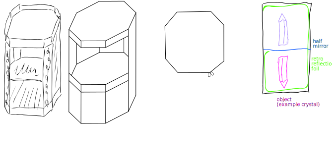
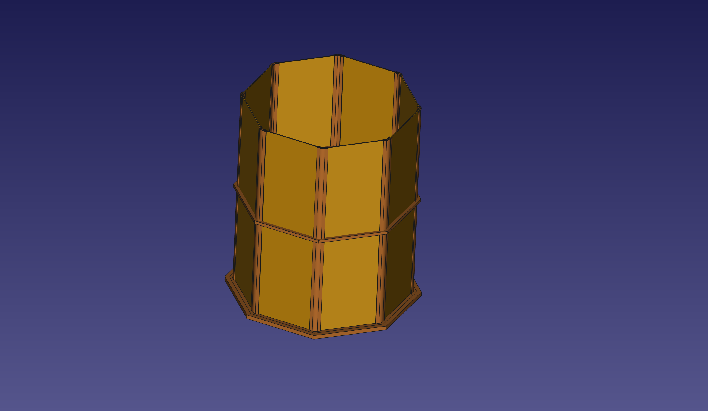

<!--lint disable list-item-indent-->
<!--lint disable list-item-bullet-indent-->

# magic_lantern
magic lantern with *holographic* visuals

inspired by [Hackerspace FFM - HoloDings](https://www.hackerspace-ffm.de/wiki/index.php?title=HoloDings)  
uses the [AIRR "Aerial Imaging by Retro‐Reflection" concept developed by Prof. Yamamoto](http://www.k2.t.u-tokyo.ac.jp/perception/AIRR_Tablet/index-e.html)

## research
for some links to shops for materials have a look at [research.md](research.md)

## status
- finalize design
- create cad model
- ordered retro-reflex foil
- requested samples for mirror foil

---

## License
<!-- license info -->

 

    all files in magic_lantern
 by
<a
    xmlns:cc="http://creativecommons.org/ns#"
    href="https://github.com/s-light/magic_lantern"
    property="cc:attributionName"
    rel="cc:attributionURL">
    Stefan Krüger (s-light)
</a>
are licensed under a 
<a rel="license" href="http://creativecommons.org/licenses/by/4.0/">
    Creative Commons Attribution 4.0 International License
</a>.

all software parts/files are licensed under [MIT](LICENSE).
